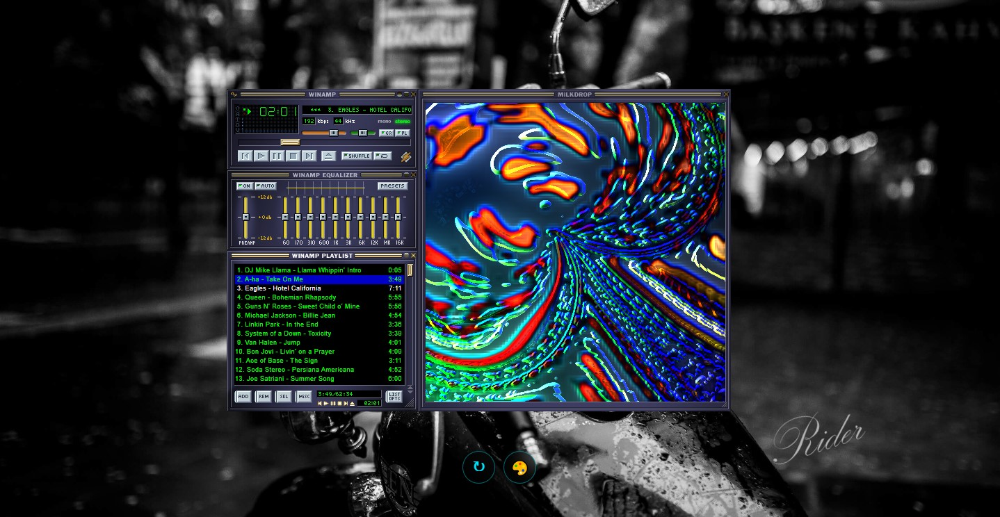

# WebAmpMod - Reproductor WinAmp Web

  <h3><a href="https://ridercalcina.github.io/WebAmpMod/">🚀 ¡ABRE EL REPRODUCTOR! 🚀</a></h3>

Un reproductor de música web basado en la estética clásica de Winamp, optimizado para ser ligero, personalizable y funcional tanto en computadoras como en dispositivos móviles.

## 🚀 Características principales
- **Webamp Core**: Motor de reproducción basado en Winamp 2.9.
- **Soporte de Skins**: Incluye un selector dinámico para cambiar la apariencia (.wsz) al instante.
- **Visualizaciones Milkdrop**: Integración con Butterchurn para visualizaciones psicodélicas.
- **Optimización Móvil**: Control de reproducción mediante Media Session API y sistema anti-suspensión (Wake Lock).
- **Biblioteca Local**: Cargado con una selección de clásicos del Rock, Pop y Metal.

## 🛠️ Estructura del Proyecto
- `/assets/music`: Archivos MP3 locales.
- `/assets/skins`: Pieles clásicas y modernas para el reproductor.
- `/assets/images`: Recursos visuales y fondos.
- `index.html`: El núcleo del proyecto con la lógica documentada.

## 💳 Créditos y Referencias
Este proyecto ha sido posible gracias a las siguientes tecnologías de código abierto:
- **[Webamp](https://github.com/captbaritone/webamp)**: Recreación de Winamp 2 en HTML5 y JS.
- **[Butterchurn](https://github.com/jberg/butterchurn)**: Implementación de Milkdrop (visualizador).
- **[Google Fonts](https://fonts.google.com/)**: Tipografía 'Inter' para la interfaz.
- **[Webamp Skins Museum](https://skins.webamp.org/)**: La fuente oficial para descargar miles de skins clásicas.

## 📄 Licencia
Este proyecto es de uso libre con fines educativos y de entretenimiento.
